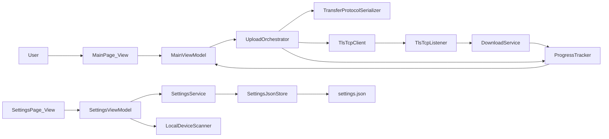

# File Transfer App Implementation Plan

## Scope and Inputs

- Source requirements: `[o:/Code/file-transfer-app/rules/app.md](o:/Code/file-transfer-app/rules/app.md)`, `[o:/Code/file-transfer-app/rules/dotnet_desktop_best_practices.md](o:/Code/file-transfer-app/rules/dotnet_desktop_best_practices.md)`, `[o:/Code/file-transfer-app/diagrams/system-context.dsl](o:/Code/file-transfer-app/diagrams/system-context.dsl)`, `[o:/Code/file-transfer-app/diagrams/containers.dsl](o:/Code/file-transfer-app/diagrams/containers.dsl)`, `[o:/Code/file-transfer-app/diagrams/component-settings.dsl](o:/Code/file-transfer-app/diagrams/component-settings.dsl)`, `[o:/Code/file-transfer-app/diagrams/component-transfer.dsl](o:/Code/file-transfer-app/diagrams/component-transfer.dsl)`, `[o:/Code/file-transfer-app/design/design-concept.png](o:/Code/file-transfer-app/design/design-concept.png)`.
- Delivery includes: core app + protocol activation + Windows and Debian packaging.
- Security model: LAN trust with self-signed certs and trust-on-first-use (TOFU).

## Target Repository Structure

- Create and populate:
  - `[o:/Code/file-transfer-app/src](o:/Code/file-transfer-app/src)`
  - `[o:/Code/file-transfer-app/test](o:/Code/file-transfer-app/test)`
  - `[o:/Code/file-transfer-app/installer](o:/Code/file-transfer-app/installer)`
  - `[o:/Code/file-transfer-app/bin](o:/Code/file-transfer-app/bin)`
  - `[o:/Code/file-transfer-app/scripts](o:/Code/file-transfer-app/scripts)`
- Use SDK-style projects and Central Package Management via `Directory.Packages.props`.

## Solution and Projects

- `src/FileTransfer.App` (Avalonia UI: Views, styles, App bootstrap, DI wiring).
- `src/FileTransfer.ViewModels` (MVVM state, commands, progress, validation).
- `src/FileTransfer.Core` (contracts, models, protocol messages, orchestration).
- `src/FileTransfer.Infrastructure` (TCP/TLS streaming, file IO, settings JSON store, device scan, protocol activation integration).
- `test/FileTransfer.UnitTests` (ViewModel + service unit tests).
- `test/FileTransfer.IntegrationTests` (real-stream transfer, cancellation, error paths).
- `installer/windows` (WiX setup).
- `installer/linux/debian` (control/spec scripts + packaging workflow).

## Architecture and Data Flow

## Functional Implementation Plan

### 1) Foundation and Cross-Cutting Setup

- Initialize solution, project references, nullable, analyzers, and logging.
- Configure DI (`Microsoft.Extensions.DependencyInjection`) for services and view models.
- Add global exception handling and structured logs (no sensitive data).
- Define shared domain models: transfer item, session, progress snapshot, app settings.

### 2) UI and UX (matching design)

- Build two pages (Main, Settings) with Avalonia controls matching design concept.
- Main page:
  - Add file/folder (native pickers), queue TreeView, remove/unselect, clear queue.
  - Start upload / cancel toggle, progress bar with `current/total` indicator.
- Settings page:
  - Detect devices to combo-box, max parallel uploads numeric input.
  - Download folder browse and text box.
  - Theme RadioButtons (`Dark`, `Light`, `System`) with real-time apply.
- Enforce minimum content size 500x500 and vertical scrolling on settings content.

### 3) Settings Service and Persistence

- Create typed settings model with defaults:
  - Download folder = user Downloads path (Windows/Linux).
  - Max parallel uploads default (safe low concurrency).
  - Last selected target IP, theme mode, trusted peer fingerprints.
- Implement JSON read/write in app directory with migration-safe versioning field.
- Implement local device scanning strategy (LAN subnet ping/TCP probe) and throttled updates.

### 4) File Transfer Protocol and Transport

- Define lightweight framed protocol over raw TCP + `SslStream`:
  - Handshake, manifest metadata, chunk frames, completion, cancel, and error frames.
- Implement asynchronous streaming upload/download with buffered IO.
- Enforce chunking rule: files larger than 10 MB split into 5 MB chunks.
- Avoid full-file memory load; dispose streams/resources deterministically.
- Implement receive pipeline that recreates folder structure in selected download directory.

### 5) Security (LAN TOFU)

- Generate self-signed cert on first launch.
- On first connection to unknown peer: store fingerprint and trust.
- On mismatch: block transfer and show warning requiring explicit re-trust.
- Persist trusted fingerprints in settings JSON.

### 6) Concurrency, Progress, and Cancellation

- Use bounded parallel transfer workers from settings (`MaximumParallelUploads`).
- Propagate `CancellationToken` through queue execution and stream operations.
- Aggregate per-file and overall progress for UI updates.
- Ensure cancel transitions UI back to `Start upload` state reliably.

### 7) Protocol Activation

- Define custom URI scheme (e.g., `filetransfer://`).
- Add argument parser and activation handler to open app and prefill transfer target/intent.
- Register protocol handlers for Windows and Debian packaging scripts.

### 8) Packaging and Distribution

- Windows:
  - Build WiX installer including app binaries, protocol registration, shortcuts.
  - Add scripts to produce installer into `[o:/Code/file-transfer-app/bin](o:/Code/file-transfer-app/bin)`.
- Debian:
  - Create `.deb` packaging metadata and post-install scripts for protocol registration.
  - Add build script to generate Debian package artifact in `bin`.
- Add release scripts under `[o:/Code/file-transfer-app/scripts](o:/Code/file-transfer-app/scripts)`.

### 9) Testing Strategy

- Unit tests:
  - ViewModel commands/state transitions, validation, progress updates.
  - Settings service defaults/migrations, protocol frame encode/decode.
- Integration tests:
  - End-to-end transfer (file + folder), cancellation, interrupted transfer handling.
  - TLS trust bootstrap and mismatch behavior.
  - Large file stream path (chunking + memory safety checks).
- Add smoke/manual checklist for UI flows and installers.

### 10) Documentation and Operational Readiness

- Add README sections for architecture, run/build/package steps, protocol URI usage.
- Add troubleshooting guide for LAN/firewall/TLS trust prompts.
- Provide script entrypoints for local dev and CI packaging.

## Milestones

- M1: Solution scaffolding + UI shells + settings persistence.
- M2: Transfer protocol + upload/download streaming + progress/cancel.
- M3: TLS TOFU trust + device detection + protocol activation.
- M4: Test suite stabilization + WiX + Debian packaging + docs.

## Risks and Mitigations

- LAN scan false positives/slow scans: use async throttling + cancellable scans.
- TLS trust UX confusion: clear first-use prompt and mismatch remediation flow.
- Large file memory pressure: strict streaming-only code paths and integration tests.
- Packaging drift across OS: scripted, repeatable builds and smoke tests per platform.
